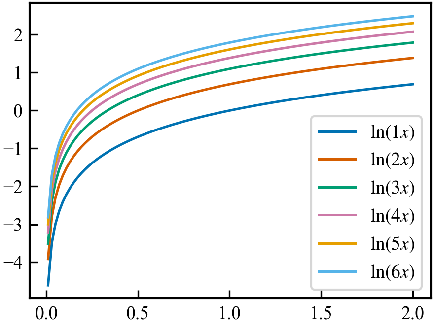
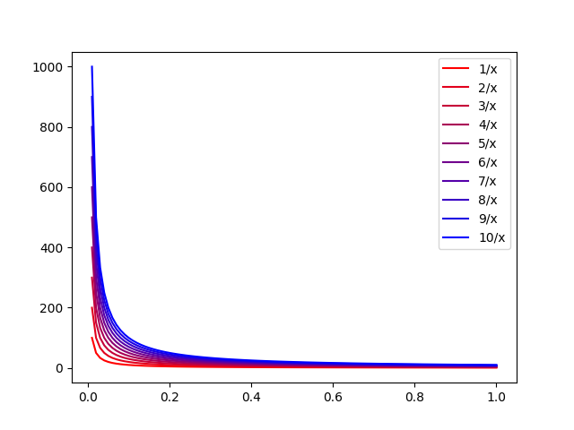
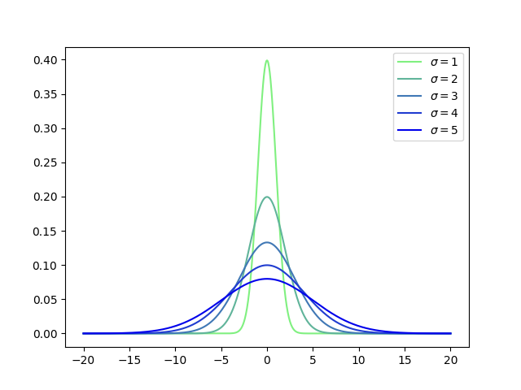

# Python-plot-style
The repository contains different kinds of style for plot in Python. You can use them conveniently.

If you have advice, please tell me in issue.

## Example
### 1 画图风格的设定与使用
在`styles.yaml`中设定画图风格,例如：
```yaml
# styles.yaml
Simple:
  # ===== 字体 =====
  font:
    font.family: serif
    font.serif:
      - Times New Roman
    mathtext.fontset: stix
    font.size: 10

  # ===== 图尺寸 =====
  figsize:
    figure.figsize: [3.5, 2.6]

  # ===== 分辨率 =====
  dpi:
    figure.dpi: 300
    savefig.dpi: 300

  # ===== 线条 =====
  linestyle:
    lines.linewidth: 1.2
    lines.markersize: 5

  # ===== 坐标轴 =====
  axis:
    axes.linewidth: 1.0
    axes.labelsize: 10
    axes.titlesize: 10
    axes.spines.top: true
    axes.spines.right: true

  # ===== 刻度 =====
  tick:
    xtick.labelsize: 9
    ytick.labelsize: 9
    xtick.direction: in
    ytick.direction: in
    xtick.major.size: 4
    ytick.major.size: 4

  # ===== 图例 =====
  legend:
    legend.fontsize: 9
    legend.frameon: true

  # ===== 保存 =====
  save_settings:
    savefig.bbox: tight
    savefig.pad_inches: 0.02

  # ===== 配色 =====
  colors:
    - "#0072B2"
    - "#D55E00"
    - "#009E73"
    - "#CC79A7"
    - "#E69F00"
    - "#56B4E9"
    - "#B2182B"
    - "#F0E442"
    - "#999999"
    - "#332288"
    - "#88CCEE"
    - "#000000"
```

在绘图时，只需要使用`apply_style("Simple")`函数就能设置好这个画图风格。
（完整代码见`example_style.py`）



### 2 使用渐变色画图
$$
y = \frac{k}{x}
$$
```python
colors = color_gradient_norm((255, 0, 0), (0, 0, 255), num) # 产生红色和蓝色之间的渐变色
```
（完整代码见`example_frackx.py`）



$$
y = \frac{1}{\sqrt{2\pi}\sigma} e^{-\frac{(x-\mu)^2}{2 \sigma^2}}
$$
```python
colors = color_gradient_norm((128, 240, 128), (0, 0, 235), num)
 # 产生绿色和蓝色之间的渐变色
```
（完整代码见`example_Gauss.py`）


## TODO
- [x] 把example的图片加入本README.md文件里
- [x] 加入论文配色的类
- [x] 根据GPT的建议修改PlotStyle类，并测试
- [x] 若可以的话，将styles.py文件改成yaml文件